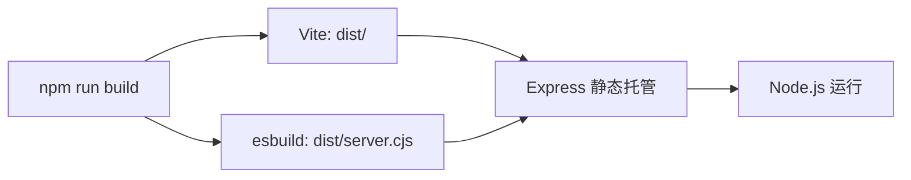

# 素织手作 — 开发文档

> 版本: v1.0 · 最后更新: 2026-05-30 · 技术栈: React 19 + TypeScript + Vite 6 + Tailwind CSS 4 + Express

---

## 1. 项目架构

### 1.1 整体架构

```
┌─────────────────────────────────────────────────┐
│                  浏览器 (Client)                  │
│  ┌───────────┐  ┌────────────┐                   │
│  │ Landing   │  │ Studio     │  React SPA        │
│  │ Page      │  │ Page       │                   │
│  └─────┬─────┘  └─────┬──────┘                   │
│        └───────┬───────┘                          │
│                │                                   │
│         ┌──────┴──────┐                            │
│         │   App.tsx    │  Router (state-based)    │
│         └──────┬──────┘                            │
│                │                                   │
│         ┌──────┴──────┐                            │
│         │   Vite Dev   │  HMR / Static Serve      │
│         │   Server     │                            │
│         └──────┬──────┘                            │
├────────────────┼──────────────────────────────────┤
│    Express.js  │  (server.ts)                      │
│                ▼                                   │
│  ┌─────────────────────────┐                       │
│  │  /api/gemini/suggest    │  Gemini AI            │
│  │  /api/gemini/chat       │  API 路由             │
│  └─────────────────────────┘                       │
│                │                                   │
│         ┌──────┴──────┐                            │
│         │ Google GenAI │  SDK                      │
│         └─────────────┘                            │
└─────────────────────────────────────────────────────┘
```

### 1.2 技术选型

| 层面 | 技术 | 选型理由 |
|------|------|----------|
| **UI 框架** | React 19 | 成熟生态，Server Component 可选，并发渲染提升 |
| **语言** | TypeScript 5.8 | 类型安全，减少运行时错误 |
| **构建工具** | Vite 6 | 极速 HMR、原生 ESM、优秀开发体验 |
| **样式** | Tailwind CSS 4 | 原子化 CSS，零运行时，tree-shaking 友好 |
| **动画** | Motion (motion/react) | React 19 优先，声明式动画 API |
| **高级动画** | GSAP 3 + ScrollTrigger | 复杂滚动驱动动画 |
| **图标** | Lucide React | 轻量、一致性好的开源图标库 |
| **后端** | Express 4 | 简单可靠，对 SSR/API 场景友好 |
| **AI SDK** | @google/genai | Google Gemini 官方 SDK |
| **服务端运行** | tsx | TypeScript 直接运行，无需编译步骤 |

### 1.3 项目目录

```
my-bag-studio/
├── server.ts                  # Express 服务端 + AI API
├── src/
│   ├── main.tsx               # React 入口
│   ├── App.tsx                # 根组件 + 视图路由
│   ├── index.css              # Tailwind + 全局样式
│   ├── types.ts               # 所有 TypeScript 类型
│   ├── data.ts                # 静态数据（材质、尺寸等）
│   └── components/
│       ├── Navbar.tsx          # 固定导航栏
│       ├── LandingPage.tsx     # 品牌落地页（~730行）
│       ├── StudioPage.tsx      # 设计工作室（~1310行）
│       └── BagVisualizer.tsx   # SVG 包袋渲染器（~490行）
├── public/images/             # 图片资源（23张）
├── index.html
├── vite.config.ts
├── tsconfig.json
├── package.json
└── .env.example
```

---

## 2. 路由设计

项目采用**状态驱动路由**（非 React Router），通过 `App.tsx` 的 `currentView` 状态控制页面切换。

```typescript
// App.tsx
const [currentView, setCurrentView] = useState<"landing" | "studio">("landing");

// 视图切换
{currentView === "landing" ? <LandingPage /> : <StudioPage />}
```

| View | 组件 | 访问方式 |
|------|------|----------|
| `landing` | `LandingPage` | 默认首页 / Logo 点击 |
| `studio` | `StudioPage` | 导航栏 CTA / 落地页 CTA |

**选择原因**: 项目只有 2 个视图，无需引入路由库，减少依赖。

---

## 3. 组件树与数据流

### 3.1 组件层级

```
App
├── Navbar
│   ├── Props: currentView, onViewChange
│   └── State: mobileMenuOpen, navHidden (scroll)
│
├── LandingPage
│   ├── Props: onEnterStudio
│   ├── State: openFaq, showModal
│   └── Sub-Components:
│       └── ContactModal
│           └── Props: onClose
│           └── State: submitted, sending
│
└── StudioPage
    ├── State:
    │   ├── config: BagConfiguration        ← 核心配置状态
    │   ├── activeStep: 当前步骤
    │   ├── aiStylistReport: AI 建议
    │   ├── messages: 聊天记录
    │   ├── savedDesigns: 保存的设计方案
    │   ├── isCheckoutOpen, orderConfirmed
    │   └── checkoutForm: 结算表单
    │
    ├── BagVisualizer (props: config)
    │   └── SVG 实时渲染
    │
    ├── 6 步配置面板 (由 activeStep 控制显示)
    ├── Pricing & Save 面板
    ├── Saved Designs Gallery
    ├── Floating AI Chat
    └── Checkout Modal
```

### 3.2 核心数据流

```
用户操作 → 更新 config 状态 → 触发 React 重渲染
    ├── BagVisualizer 读取 config，更新 SVG
    ├── 价格面板重新计算总价
    └── (可选) 调用 AI 造型顾问 API → 更新 aiStylistReport
```

**关键设计决策**: `config` 作为唯一真实来源（Single Source of Truth），所有配置变更都通过 `setConfig()` 进行，确保预览 + 价格 + AI 建议的数据一致性。

### 3.3 状态变更流程

```
用户点击某个面料选项
    → setConfig({ ...config, canvas: selectedCanvas })
    → consultStylist(newConfig)  // 异步调用 AI
        → 显示加载状态
        → API 返回 / 降级兜底
        → 更新 aiStylistReport
```

---

## 4. 落地页关键实现细节

### 4.1 滚动隐藏导航栏

```typescript
// Navbar.tsx — 滚动检测
const handleScroll = () => {
  const current = window.scrollY;
  if (current > lastScroll.current && current > 80) {
    setNavHidden(true);   // 向下滚动 → 隐藏
  } else {
    setNavHidden(false);  // 向上滚动 → 显示
  }
  lastScroll.current = current;
};
```

### 4.2 GSAP 横向画廊

```typescript
// LandingPage.tsx — Gallery 区域
const ctx = gsap.context(() => {
  const trackWidth = el.scrollWidth;
  const maxX = -(trackWidth - window.innerWidth + 64);

  // 水平滚动 + fixed pin
  gsap.to(el, {
    x: maxX,
    ease: "none",
    scrollTrigger: {
      trigger: section,
      start: "top top",
      end: () => "+=" + Math.abs(maxX),
      pin: true,
      scrub: 1,
    },
  });

  // 入场 scale 动画
  gsap.from(items, {
    scrollTrigger: { trigger: section, start: "top 90%" },
    scale: 0.85,
    opacity: 0,
    stagger: 0.08,
  });
});
```

**注意**: 使用 GSAP context 管理动画生命周期，组件卸载时通过 `ctx.revert()` 清理。

### 4.3 步骤高亮

```
滚动到步骤元素 → ScrollTrigger onEnter → 添加 .active class
→ CSS 切换数字圆形背景色
```

### 4.4 联系表单存储

```typescript
// localStorage 存储
const key = "canvascraft_inquiries";
const existing = JSON.parse(localStorage.getItem(key) || "[]");
existing.push(formData);
localStorage.setItem(key, JSON.stringify(existing));
```

---

## 5. 设计工作室关键实现细节

### 5.1 配置状态管理

```typescript
// 核心配置类型
interface BagConfiguration {
  canvas: CanvasMaterial;
  leather: LeatherMaterial;
  hardware: HardwareMaterial;
  size: BagSizeConfig;
  monogram: MonogramConfig;  // { text, font, style, position }
  shoulderStrap: boolean;
  keyClasp: boolean;
  dustBag: boolean;
  atmosphere: AtmosphereConfig;
}
```

**设计决策**: 未使用 Context/Redux/Zustand，因为配置状态只在 `StudioPage` 组件树内使用，props drilling 深度仅 2 层（StudioPage → BagVisualizer）。

### 5.2 SVG 渲染架构

`BagVisualizer.tsx` 使用内联 SVG 渲染包袋，组织层级：

```
SVG (500x500 viewBox)
├── 阴影 (ellipse)
├── 肩带 (path, 条件渲染)
├── 包身主体 (path)
│   ├── 织物纹理 (feTurbulence filter)
│   └── 立体阴影 (black/white 渐变)
├── 前口袋 (path)
│   ├── 口袋皮革饰边
│   └── 双缝线 (stroke-dasharray)
├── 手柄 (path, 皮革色)
│   ├── 双缝线装饰
│   └── 锚点皮革环
├── 五金铆钉 (circle)
│   └── 渐变填充 (按硬件类型变化)
├── 印记文字 (text)
│   └── 位置: 口袋中央 / 皮革吊牌
└── 钥匙扣 (path, 条件渲染)
```

**材质视觉效果**:
- 帆布纹理: `feTurbulence (fractalNoise, baseFrequency=0.75) + feColorMatrix (opacity=0.12)`
- 皮革纹理: `feTurbulence (baseFrequency=0.9, opacity=0.08)`
- 五金拉丝: 多层 `linearGradient` 模拟金属质感

### 5.3 AI 造型顾问 API

```
POST /api/gemini/suggest-stylist
Body: { canvas, leather, hardware, size, monogram }
Response: { conceptName, stylingCritique, coordinateGuide, heritageNarrative }

POST /api/gemini/chat
Body: { messages, activeBag }
Response: { text }
```

**降级策略**: GEMINI_API_KEY 未配置时，服务端返回本地模拟数据，不阻塞用户操作。

```
API 调用流程:
1. 前端发送请求到 /api/gemini/suggest-stylist
2. 服务端检测 ai 实例是否存在
3. 无密钥 → 返回本地兜底 JSON（包含所有字段）
4. 有密钥 → 组装 prompt → 调用 Gemini API → 解析 JSON 返回
```

### 5.4 价格计算

```typescript
const calculateTotalPrice = () => {
  let price = BASE_PRICE;               // ¥450
  price += config.size.additionalPrice; // 加价: 0 / ¥90 / ¥195
  if (config.shoulderStrap) price += 45;
  if (config.keyClasp) price += 25;
  if (config.dustBag) price += 15;
  return price;
};
```

### 5.5 预设风格映射

| 预设 | Canvas | Leather | Hardware | Size |
|------|--------|---------|----------|------|
| 自然纯粹 | 有机暖沙 #0 | 雪花石膏白 #3 | 拉丝黄铜 #0 | 精巧 #0 |
| 森林漫游 | 秋鼠尾绿 #1 | 植鞣焦糖 #0 | 拉丝黄铜 #0 | 经典 #1 |
| 暗夜黑曜 | 墨曜黑 #2 | 午夜曜黑 #2 | 阳极暗黑 #2 | 经典 #1 |
| 落日画廊 | 信乐陶土 #3 | 浓缩深棕 #1 | 抛光银钢 #1 | 远行 #2 |

---

## 6. 样式体系

### 6.1 Tailwind 配置

```css
/* 自定义主题 tokens */
@theme {
  --font-sans: "Inter", ui-sans-serif, system-ui, sans-serif;
  --font-serif: "Playfair Display", ui-serif, serif;
  --font-serif-sc: "Noto Serif SC", ui-serif, "Songti SC", serif;
  --font-mono: "JetBrains Mono", ui-monospace, monospace;
}
```

### 6.2 设计 Token

| Token | 值 | 用途 |
|-------|-----|------|
| `--color-dark` | `#2c2416` | 主要文字、深色背景 |
| `--color-gold` | `#c4956a` | 品牌强调色、点缀 |
| `--color-cream` | `#faf6f0` | 页面底色 |
| `--color-taupe` | `#e8d5c4` | 边框、分隔线、浅色装饰 |
| `--color-muted` | `#8b7d6b` | 辅助文字 |

### 6.3 动画持续时间和缓动

| 场景 | 持续时间 | 缓动 |
|------|----------|------|
| fade-up 入场 | 0.6s | easeOut |
| hover 效果 | 0.3-0.4s | ease |
| GSAP scrub | 1.0s | none (linear) |
| Modal 入场 | 0.3s | ease |

---

## 7. 性能优化

### 7.1 已实施的优化

| 优化 | 实现方式 |
|------|----------|
| 图片懒加载 | `loading="lazy"` 属性 |
| CSS 动画优先 | 使用 transform/opacity 避免重排 |
| GSAP context | 组件卸载时自动清理动画 |
| 条件渲染 | 配置面板按 activeStep 分区渲染 |
| 本地降级 | AI 不可用时零等待的本地回复 |

### 7.2 潜在优化空间

| 优化 | 建议方案 | 优先级 |
|------|----------|--------|
| 代码分割 | `React.lazy()` 拆分 LandingPage / StudioPage | 高 |
| 图片优化 | 使用 WebP 格式 + 响应式图片 (srcset) | 中 |
| 字体预加载 | `<link rel="preload">` 关键字体 | 中 |
| SVG 优化 | 对复杂 filter 使用 will-change 或 GPU 加速 | 低 |
| Bundle 分析 | 使用 `vite-plugin-visualizer` 分析依赖 | 低 |

### 7.3 构建产物

```bash
npm run build  # 输出:
# dist/            → 前端静态资源
# dist/server.cjs  → 服务端 bundle (esbuild)
```

---

## 8. AI 集成

### 8.1 Gemini API 配置

```typescript
// server.ts
const ai = new GoogleGenAI({
  apiKey: process.env.GEMINI_API_KEY,
  httpOptions: {
    headers: { "User-Agent": "aistudio-build" },
  },
});
```

### 8.2 Prompt 设计要点

**造型顾问 prompt**（`/api/gemini/suggest-stylist`）:
- 角色设定: "资深设计总监与材质档案管理员"
- 语气要求: "诗意的、温暖的、精致的、谦逊的"
- 输出格式: 结构化 JSON（通过 responseSchema 约束）
- 不使用 emoji、感叹号、促销语气

**聊天助手 prompt**（`/api/gemini/chat`）:
- 角色设定: "优雅、温暖且知识渊博的设计助理"
- 默认注入当前配置作为上下文
- 回复长度: 120 字以内
- 温度: 0.8（适度创造性）

### 8.3 降级策略

```
API 密钥未配置 → 服务端返回本地模拟数据
├── suggest-stylist: 基于配置拼接诗意的三段式回复
└── chat: 关键词匹配模式
    ├── 包含"帆布" → 回复冈山帆布工艺
    ├── 包含"皮革" → 回复植鞣工艺
    ├── 包含"搭配" → 回复配色建议
    └── 默认 → 通用回复
```

---

## 9. 已知限制与注意事项

### 9.1 技术限制

| 限制 | 说明 | 建议改进 |
|------|------|----------|
| 无用户系统 | 设计保存在 localStorage，设备间不可同步 | 接入 Firebase Auth + Firestore |
| 无真支付 | 使用模拟支付表单 | 集成微信/支付宝 SDK |
| 无后台管理 | 订单和咨询只存储在前端 | 构建管理后台 |
| 无后端数据库 | 无持久化存储层 | 接入 PostgreSQL / MongoDB |
| AI 延迟 | Gemini API 可能有 2-5s 延迟 | 添加更细粒度的加载状态 |

### 9.2 SVG 渲染限制

- 以纯 SVG 模拟 3D 效果（非真实 3D 模型）
- 仅展示正面视图，不支持旋转/缩放
- 织物纹理使用 SVG filter，低端设备可能性能受影响

### 9.3 文件规模

| 文件 | 行数 | 说明 |
|------|------|------|
| LandingPage.tsx | ~730 行 | 含 ContactModal 子组件 |
| StudioPage.tsx | ~1310 行 | 含 6 步配置 + AI Chat + Checkout |
| BagVisualizer.tsx | ~490 行 | SVG 渲染逻辑 |
| server.ts | ~187 行 | Express + AI 路由 |

**建议**: 当 StudioPage 功能继续增长时，考虑拆分为多个文件：
- `StudioConfig.tsx` — 配置面板
- `StudioChat.tsx` — AI 聊天
- `StudioCheckout.tsx` — 结算

---

## 10. 本地开发

### 10.1 快速开始

```bash
npm install
cp .env.example .env.local    # 配置 GEMINI_API_KEY（可选）
npm run dev                    # http://localhost:3000
```

### 10.2 脚本

| 命令 | 说明 |
|------|------|
| `npm run dev` | 开发服务器 (Vite HMR + Express) |
| `npm run build` | 生产构建 (Vite + esbuild) |
| `npm start` | 生产运行 |
| `npm run lint` | TypeScript 类型检查 |

### 10.3 环境变量

| 变量 | 说明 | 默认值 |
|------|------|--------|
| `GEMINI_API_KEY` | Google Gemini API 密钥 | 无（可选） |
| `APP_URL` | 部署后的服务 URL | 无（可选） |

---

## 11. 生产部署

### 11.1 构建流程



### 11.2 部署平台

支持 Node.js 的任意平台：
- **Cloud Run** (推荐，自动扩缩容)
- **Vercel** (需配置 serverless function)
- **Railway** (一键部署)
- **阿里云 ECS / 腾讯云 CVM** (传统 VPS)

### 11.3 生产注意事项

1. 确保 `GEMINI_API_KEY` 通过环境变量注入，不硬编码
2. 配置反向代理（Nginx）处理 SSL 终止
3. 静态资源设置 CDN 缓存策略
4. 监控 API 调用成本（Gemini API 按 token 计费）

---

## 12. 技术债务与改进计划

### 12.1 优先项

- [ ] 组件拆分（LandingPage.tsx 和 StudioPage.tsx 文件过大）
- [ ] 提取配置数据到独立文件（目前预设风格 mapping 在组件内）
- [ ] 添加单元测试（Vitest + Testing Library）
- [ ] 使用 React.lazy 实现代码分割

### 12.2 低优先项

- [ ] 动画系统统一（目前混合使用 motion/react 和 GSAP）
- [ ] 替换图片为 WebP 格式
- [ ] 添加错误边界（Error Boundaries）
- [ ] ESLint 配置增强

---

## 13. 依赖清单

```json
{
  "dependencies": {
    "react": "^19.0.1",
    "react-dom": "^19.0.1",
    "vite": "^6.2.3",
    "@vitejs/plugin-react": "^5.0.4",
    "@tailwindcss/vite": "^4.1.14",
    "tailwindcss": "^4.1.14",
    "motion": "^12.23.24",
    "gsap": "^3.15.0",
    "lucide-react": "^0.546.0",
    "express": "^4.21.2",
    "@google/genai": "^2.4.0",
    "dotenv": "^17.2.3",
    "tsx": "^4.21.0",
    "typescript": "~5.8.2"
  },
  "devDependencies": {
    "@types/express": "^4.17.21",
    "@types/node": "^22.14.0",
    "@types/react": "^19.2.15",
    "autoprefixer": "^10.4.21",
    "esbuild": "^0.25.0"
  }
}
```
